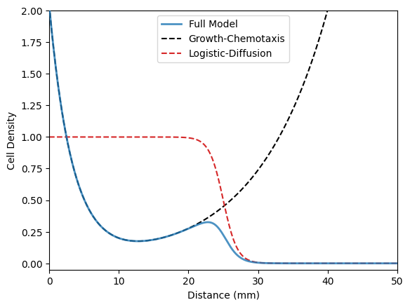

# qcquant.py
Quantitative Chemotaxis Quantification (qcquant)
Version: 0.5.1




# TODO LIST
1. Update install instructions to pip install from github
2. add corner and emcee to the setup.py
3. maybe add `jupyterlab` to setup 
4. upload calibration templated ipynb
5. update readme instructions
6. add a error to the calibration script for when there is no data present (usually the prefix is bad)


## Install

#### Set up a Python virtual environment
``` bash
## set up a new virtual environment (only do this once)
conda create -n "qcquant" python==3.9

## activate that virtual environment 
conda activate qcquant

## install the necessary libraries
python -m pip install "napari[all]"
python -m pip install numba matplotlib
python -m pip install -e ./
```


## Plate Analysis
The first functionality in `qcquant` is the `Napari` based GUI to extract radial averages from a bacterial plate assay. Generally, we refer to this as `qcquant`.

#### Launch qcquant
``` bash
conda activate qcquant
qcquant
```

#### Guide
1. Load data image
   1. Select the ".tif" image to analyze by using the "Select file" button to enter the path in the "Data File" box
   2. Click "Load Data" button (probably the epi-illumination option)
2. Set pixel calibration
   1. [Option 1] Update the "Calibration (um/px)" box to the known value
   2. [Option 2] Calibrate the image using the plated outer diameter (OD)
      1. Create a new shape layer
      2. Draw an elipse around the outer edge of the plate (this probably won't be perfectly circular)
      3. Adjust the corners to perfect the position of the elipse 
      4. Set the "Dish O.D. (mm)" box to the diameter of the plate (100 mm for standard Petri dishes)
      5. Click the "Calculate Conversion (circle)" button
      6. You can use the value in "Calibration (um/px)" for any subsequent images acquired with the same imaging parameters (*i.e.*, Option 1).
3. Locate the center of the bacterial growth
   1. Select the automatically created "COM" layer (left hand toolbar)
   2. Click the "Select points" arrow
   3. Drag the point to approximately the center of the growth (note the last point created in this layer is the one used for the analysis)
   4. Click the "Find Radial Center" to refine the center position by minimize the pixel variance within each radial bin (*i.e.*, the 'center' is the point with the most symmetric radial profile). The "Mean" option uses the average of all radial rings for this determination, the "Max" option uses the largest variance ring as the minimization target.
   5. Movement of the COM from the initial position during optimization is limited by "Locate Extent (mm)" (*i.e.,* it will not move the COM further than this value)
4. Calculate radial average
   1. Set the maximum radius of the radial averaging by setting the "Extent (mm)" box. This will be 50 for standard Petri dishes.
   2. Click the "Calculate Radial Average" Button
   3. The "Radial Bin Width (mm)" box sets the spacing between datapoints in the radial profile.
   4. The "Smoothing Kernel (bins)" is (Guassian) smoothing width. Note that both the raw and smoothed profiles are exported
5. Save radial average data
   1. Upon calculate a radial average, that profile is shown in the "Radial Average" tab (bottom of toolbar on the right).
   2. Raw data is shown in black; smoothed data is shown in red.
   3. If you click the "Save" button, you will be prompted for a file name. The data is saved in a text (ASCII) format with three columns (radius (mm), raw absorption, smoothed absorption).
   4. A cropped (.png) image of the plate is also saved at this time. It has the same root filename as the text file containing the data. Note that if the "Plate Image: Locate Plate?" check box is checked in the "qcquant" tab then the center of the plate will be located and placed at the center of the image; if it is not checked, then the COM will be used as the center of the image.

#### Tutorial: Calibration
Note: this is a little old and the interface layout has changed, but the basic idea remains the same.

https://github.com/ckinzthompson/qcquant/assets/17210418/d76e4741-a87e-4ba4-9d54-4b667e5decae


## Fitting: 
`qcquant` also includes fitting functions for the "Growth-Expansion" model of bacterial chemotaxis in `qcquant.fitting`. We suggest that you use a Jupyter notebook to keep track of your fitting results, because you can use one notebook for a full experiment with a separate cell for each plate. You can directly import `qcquant.fitting` and use the functions inside to perform those analyses. See the guide below for details.

#### Fitting Guide (Run on Google Colab)
Follow along to learn how to fit your data
<a href="https://colab.research.google.com/github/ckinzthompson/qcquant/blob/main/example_data/example_fitting.ipynb" target="_parent"></a>

#### Blank Template (Run on Google Colab)
Use this to analye your own data
<a href="https://colab.research.google.com/github/ckinzthompson/qcquant/blob/main/example_data/template.ipynb" target="_parent"></a>

